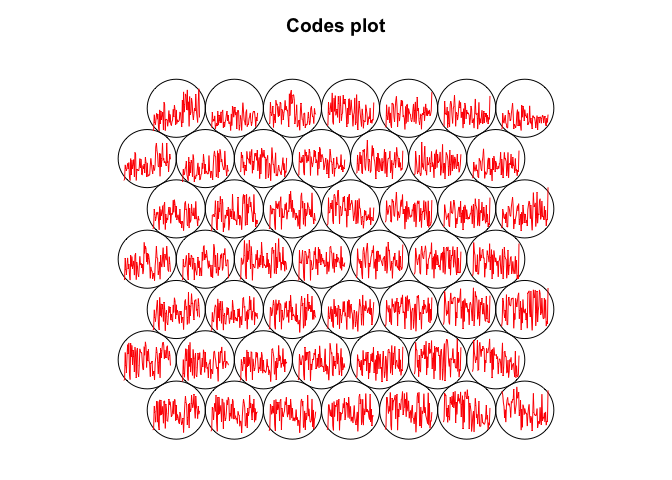
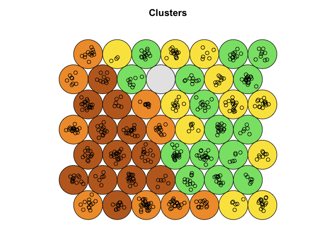
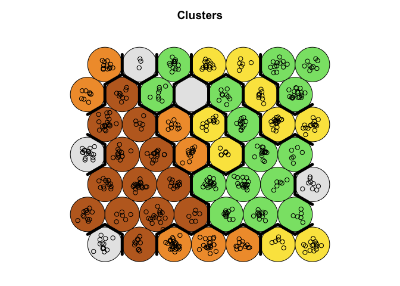
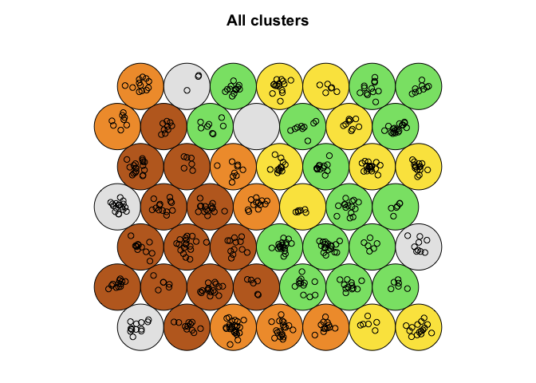
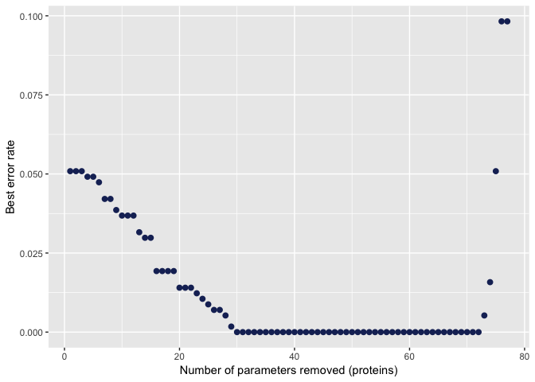
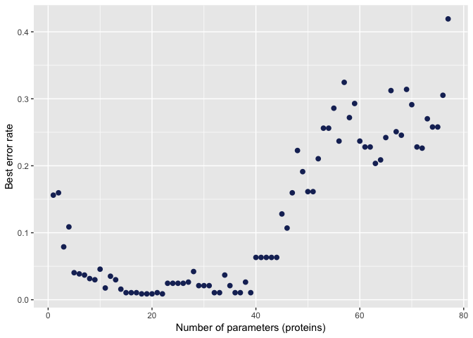
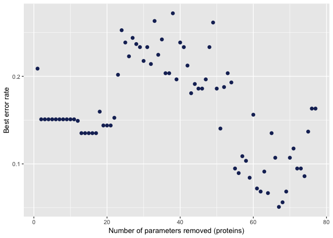
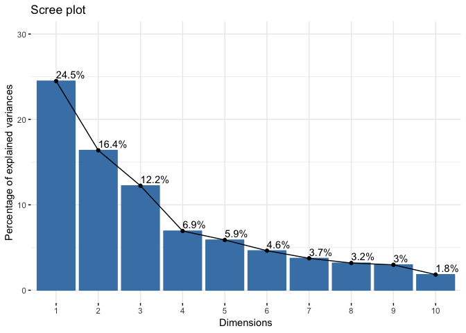
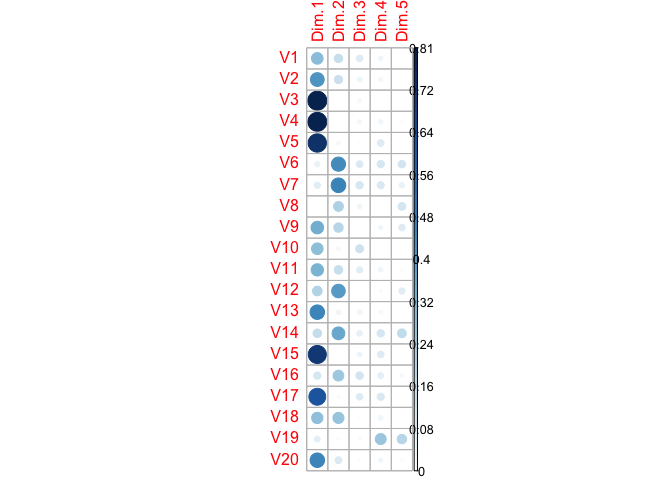
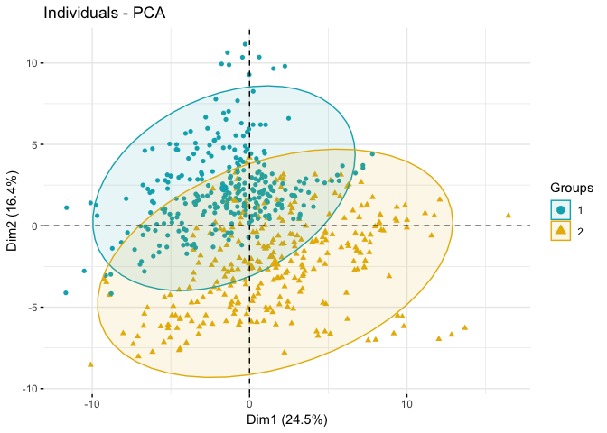

Identify Proteins Critical to Learning in a Mouse Model of Down Syndrome
================
Di Wu, Jiliang Ma and Qinyuan Wei

``` r
# colors
my_colors <- c(
  'c-CS-s' = "#88e175",
  'c-CS-m' = "#fbe44d",
  'c-SC-s' = "#bf6a26",
  'c-SC-m' = "#f19c38",
  't-CS-s' = "#f5bf43",
  't-CS-m' = "#ec5864",
  't-SC-s' = "#a8dae6",
  't-SC-m' = "#518aea",
  'none' = "#e6e6e6",
  'none1' = "#e6e6e6"
)
```

Data preprocessing
==================

``` r
library(som)
library(kohonen)
```

    ## 
    ## Attaching package: 'kohonen'

    ## The following object is masked from 'package:som':
    ## 
    ##     som

``` r
mouse_data_raw <- read.csv("./MouseDataProOnly.csv")
data_c <- mouse_data_raw[1:570, ]

data_c_mat <- subset(data_c, select=-c(MouseID, Genotype, Treatment, Behavior, class))
data_c_mat <- matrix(as.numeric(unlist(data_c_mat)), nrow=nrow(data_c_mat))

data_c_mat_11 <- subset(data_c, select=c(BRAF_N, pERK_N, S6_N, pGSK3B_N, CaNA_N, CDK5_N, pNUMB_N, DYRK1A_N, ITSN1_N, SOD1_N, GFAP_N))
data_c_mat_11 <- matrix(as.numeric(unlist(data_c_mat_11)), nrow=nrow(data_c_mat_11))

data_c_mat_66 <- subset(data_c, select=-c(MouseID, Genotype, Treatment, Behavior, class, BRAF_N, pERK_N, S6_N, pGSK3B_N, CaNA_N, CDK5_N, pNUMB_N, DYRK1A_N, ITSN1_N, SOD1_N, GFAP_N))
data_c_mat_66 <- matrix(as.numeric(unlist(data_c_mat_66)), nrow=nrow(data_c_mat_66))

cdim <- 7
som_grid_c <- somgrid(xdim = cdim, ydim = cdim, topo="hexagonal")
```

``` r
som_model_c_1<- som(data_c_mat, grid=som_grid_c, rlen=300)
# som_model_c_1$changes[300]
# plot(som_model_c_1, type = "change")
mean(som_model_c_1$distances)
```

    ## [1] 0.3291009

SOM under all proteins
======================

``` r
som_model_c_all <- som(data_c_mat, grid=som_grid_c, rlen=300) # data_c_mat or data_c_mat_11 or data_c_mat_66
plot(som_model_c_all)
```



``` r
innode <- som_model_c_all$unit.classif     # which node is the observation in
```

``` r
# number of each class in each node
els <- matrix(0, cdim*cdim, 4)
type_c <- c(1,2,3,4)
names(type_c) <- c('c-CS-s', 'c-CS-m', 'c-SC-s', 'c-SC-m')

for (i in 1:570){
  cla <- data_c[i, 'class']
  els[innode[i], type_c[[cla]]] = els[innode[i], type_c[[cla]]] + 1
}


# filter for if the node is pure
if_pure <- matrix(0, cdim*cdim, 1)
for (i in 1:(cdim*cdim)){
  if ((max(els[i,]) == sum(els[i,])) & (sum(els[i,]) != 0)){
    if_pure[i,1] <- TRUE
  }
}

49-sum(if_pure)
```

    ## [1] 17

``` r
# Draw - which color each node is 
cla_plot <- c()
for (i in 1:(cdim*cdim)){
  if (max(els[i,]) > 0) cla_plot <- c(cla_plot, which.max(els[i,]))
  else cla_plot <- c(cla_plot, 10)#################used to be 9
}
```

Finding out significantly-different proteins
============================================

``` r
# Big matrix
bigmat <- matrix(0, nrow = cdim + 2, ncol = cdim + 2)
k <- 0
for (i in 2:(cdim + 1)){
  for (j in 2:(cdim + 1)){
    k <- k + 1
    bigmat[cdim+3-i, j] <- cla_plot[k]
  }
}
bigmat_cla <- matrix(10, nrow = cdim + 2, ncol = cdim + 2)
for (i in 2:(cdim + 1)){
  ii <- cdim + 3 - i
  for (j in 2:(cdim + 1)){
    if (bigmat[i,j] == 0){  # no observation in this node
      next
    }
    else{
      if (ii%%2 == 0){
        if (bigmat[ii, j] == bigmat[ii, j-1] | bigmat[ii, j] == bigmat[ii, j+1] | bigmat[ii, j] == bigmat[ii+1, j] | bigmat[ii, j] == bigmat[ii+1, j+1] | bigmat[ii, j] == bigmat[ii-1, j] | bigmat[ii, j] == bigmat[ii-1, j+1]){
          bigmat_cla[ii,j] = bigmat[ii,j]
        }
        else{
          if(1){
            # if 80%+ then color
          }
        }
      }
      
      if (ii%%2 == 1){
        if (bigmat[ii, j] == bigmat[ii, j-1] | bigmat[ii, j] == bigmat[ii, j+1] | bigmat[ii, j] == bigmat[ii+1, j] | bigmat[ii, j] == bigmat[ii+1, j-1] | bigmat[ii, j] == bigmat[ii-1, j] | bigmat[ii, j] == bigmat[ii-1, j-1]){
          bigmat_cla[ii,j] = bigmat[ii,j]
        }
        else{
          if(1){
            # if 80%+ then color
          }
        }
      }
    }
  }
}

cluster <- c()
for (i in 2:(cdim + 1)){
  for (j in 2:(cdim + 1)){
    cluster <- c(cluster, bigmat_cla[cdim + 3 - i, j])
  }
}
```

``` r
plot(som_model_c_all, type='mapping', bgcol=my_colors[cla_plot], main = "Clusters")
```



``` r
plot(som_model_c_all, type='mapping', bgcol=my_colors[cluster], main = "Clusters")
add.cluster.boundaries(som_model_c_all, cluster, lwd = 5)
```



``` r
#print(som_model_c_all$changes)
print(cla_plot)
```

    ##  [1]  4  3  4  4  4  2  2  3  3  3  3  1  1  1  3  3  3  1  1  1  2  4  3
    ## [24]  3  4  2  1  1  3  3  4  2  1  2  2  4  3  1 10  1  2  1  4  2  1  2
    ## [47]  2  1  1

``` r
print(cluster)
```

    ##  [1] 10  3  4  4  4  2  2  3  3  3  3  1  1  1  3  3  3  1  1  1 10 10  3
    ## [24]  3  4  2  1  1  3  3  4  2  1  2  2  4  3  1 10  1  2  1  4 10  1  2
    ## [47]  2  1  1

``` r
# DFS to find largest clusters of each class
# DFS helper function
library(zeallot)
DFS_helper <- function(matt, ii, j, visited, templist){
  
  if (visited[ii,j] != 0) return (list(visited, templist))
  else if (matt[ii,j] == 10) {
    return (list(visited, templist))
    }
  else{
    visited[ii,j] <- 1
    
    if (ii%%2 == 0){
      if (matt[ii, j] == matt[ii, j-1]) c(visited, templist) %<-% DFS_helper(matt, ii, j-1, visited, templist)
      if (matt[ii, j] == matt[ii, j+1]) c(visited, templist) %<-% DFS_helper(matt, ii, j+1, visited, templist)
      if (matt[ii, j] == matt[ii+1, j]) c(visited, templist) %<-% DFS_helper(matt, ii+1, j, visited, templist)
      if (matt[ii, j] == matt[ii+1, j+1]) c(visited, templist) %<-% DFS_helper(matt, ii+1, j+1, visited, templist)
      if (matt[ii, j] == matt[ii-1, j]) c(visited, templist) %<-% DFS_helper(matt, ii-1, j, visited, templist)
      if (matt[ii, j] == matt[ii-1, j+1]) c(visited, templist) %<-% DFS_helper(matt, ii-1, j+1, visited, templist)
    }
    if (ii%%2 == 1){
      if (matt[ii, j] == matt[ii, j-1]) c(visited, templist) %<-% DFS_helper(matt, ii, j-1, visited, templist)
      if (matt[ii, j] == matt[ii, j+1]) c(visited, templist) %<-% DFS_helper(matt, ii, j+1, visited, templist)
      if (matt[ii, j] == matt[ii+1, j]) c(visited, templist) %<-% DFS_helper(matt, ii+1, j, visited, templist)
      if (matt[ii, j] == matt[ii+1, j-1]) c(visited, templist) %<-% DFS_helper(matt, ii+1, j-1, visited, templist)
      if (matt[ii, j] == matt[ii-1, j]) c(visited, templist) %<-% DFS_helper(matt, ii-1, j, visited, templist)
      if (matt[ii, j] == matt[ii-1, j-1]) c(visited, templist) %<-% DFS_helper(matt, ii-1, j-1, visited, templist)
    }
    i <- cdim+3-ii
    templist <- c((i-2)*cdim+j-1, templist)
    return (list(visited, templist))
  }
}

# the main function of DFS
DFS <- function(matt){
  
  visited <- matrix(0, nrow = cdim+2, ncol = cdim+2)
  DFS_res <- matrix(0, nrow = 4, ncol = cdim*cdim) # 4*49 record clustered nodes in each color
  DFS_count <- c(0,0,0,0) # record count of nodes in a cluster
  for (i in 2:(cdim+1)){
    for (j in 2:(cdim+1)){
      ii <- cdim + 3 - i
      templist <- c() # record the temp result of each cluster
      
      c(visited, templist) %<-% DFS_helper(matt, ii, j, visited, templist)
      # print(matt[ii,j])
      if ((length(templist) > DFS_count[matt[ii, j]]) & (is.null(templist) == FALSE)) {
        DFS_count[matt[ii, j]] <- length((templist))
        DFS_res[matt[ii,j], 1:length(templist)] <- templist
      }
    }
  }
  return (list(DFS_res, DFS_count))
}
```

``` r
# Adopt DFS and draw large cluster graph
c(large_cluster, large_count) %<-% DFS(bigmat_cla)
large_cla <- integer(cdim*cdim) + 10############used to be 9
for (i in 1:4){
  for (j in 1:(cdim*cdim)){
    if (large_cluster[i, j] > 0){
      large_cla[large_cluster[i, j]] = i
    }
  }
}
plot(som_model_c_all, type='mapping', bgcol=my_colors[cluster], main = "All clusters")
```



``` r
plot(som_model_c_all, type='mapping', bgcol=my_colors[large_cla], main = "Large clusters")
```


``` r
#som_model_c_all$codes
#som_cluster <- cutree(hclust(dist(som_model_c_all$codes)), 6)
# dist(som_model_c_all$codes)
#som_cluster
```

``` r
# Wilcoxon function
# color 1 (c-CS-s) color 2 (c-CS-m), color 3 (c-SC-s) and color 4 (c-SC-m)
my_wilcoxon <- function(col1, col3){
  vecs_1 <- matrix(0, nrow = large_count[col1], ncol = 77)
  vecs_3 <- matrix(0, nrow = large_count[col3], ncol = 77)
  som_code <- som_model_c_all$code
  for (i in 1:large_count[col1]){
    vecs_1[i,] <- som_code[[1]][((large_cluster[col1, i]-1)*77+1) : (large_cluster[col1, i]*77)]
  }
  for (i in 1:large_count[col3]){
    vecs_3[i,] <- som_code[[1]][((large_cluster[col3, i]-1)*77+1) : (large_cluster[col3, i]*77)]
  }
  
  library("dplyr")
  pro_rec <- c()
  
  for (i in 1:77){
    vec_test1 <- vecs_1[,i]
    vec_test3 <- vecs_3[,i]
    wil <- wilcox.test(vec_test1, vec_test3)
    if (wil$p.value < 0.2){
      pro_rec <- c(pro_rec, i)
    }
  }
  
  return (list(length(pro_rec), pro_rec))
}

# print(length(pro_rec))
# print(pro_rec)
```

``` r
c(wil_1_len, wil_1_protein) %<-% my_wilcoxon(1, 3)
```

    ## 
    ## Attaching package: 'dplyr'

    ## The following objects are masked from 'package:stats':
    ## 
    ##     filter, lag

    ## The following objects are masked from 'package:base':
    ## 
    ##     intersect, setdiff, setequal, union

``` r
c(wil_2_len, wil_2_protein) %<-% my_wilcoxon(2, 4)
c(wil_3_len, wil_3_protein) %<-% my_wilcoxon(2, 3)
c(wil_4_len, wil_4_protein) %<-% my_wilcoxon(1, 4)

print(wil_1_len)
```

    ## [1] 15

``` r
print(wil_1_protein)
```

    ##  [1] 22 23 24 25 31 32 47 48 55 56 57 62 69 76 77

``` r
print(wil_2_len)
```

    ## [1] 9

``` r
print(wil_2_protein)
```

    ## [1]  8  9 11 12 22 29 36 37 44

``` r
print(wil_3_len)
```

    ## [1] 17

``` r
print(wil_3_protein)
```

    ##  [1]  1  8  9 10 11 12 14 22 36 56 58 62 63 64 65 71 77

``` r
print(wil_4_len)
```

    ## [1] 5

``` r
print(wil_4_protein)
```

    ## [1] 23 35 36 41 42

K-means
=======

``` r
# class for learn (2) or not-learn (1)
real_class <- c()
for (i in 1:570){
  cla <- data_c[i, 'class']
  if (cla == 'c-CS-s' | cla == 'c-CS-m') real_class <- c(real_class, 2)
  else real_class <- c(real_class, 1)
}

# get the error rate for 77
# define the ground truth
g_truth <- matrix(0, nrow = 570, ncol = 1)
for (i in 1:570){
  if (i < 151)
    g_truth[i] <- 1
  else if (i < 301 & i > 150)
    g_truth[i] <- 2
  else if (i < 436 & i > 300)
    g_truth[i] <- 1
  else if (i > 435)
    g_truth[i] <- 2
}

km <- kmeans(data_c_mat, 2)
kmeans_res_77 <- km$cluster

# calculate error rate
err <- 0
for (i in 1:570){
  if (g_truth[i] != kmeans_res_77[i])
    err <- err + 1
}
err_rate_77 <- err/570
if (err_rate_77 > 0.5)
  err_rate_77 <- 1- err_rate_77
err_rate_77
```

    ## [1] 0.2280702

``` r
# K means clustering for 66
km <- kmeans(data_c_mat_66, 2)
kmeans_res_66 <- km$cluster
# kmeans_res
# calculate error rate
err <- 0
for (i in 1:570){
  if (g_truth[i] != kmeans_res_66[i])
    err <- err + 1
}
err_rate_66 <- err/570
if (err_rate_66 > 0.5)
  err_rate_66 <- 1- err_rate_66
err_rate_66
```

    ## [1] 0.3508772

``` r
# K means clustering for 11
km <- kmeans(data_c_mat_11, 2)
kmeans_res_11 <- km$cluster
# kmeans_res
# calculate error rate
err <- 0
for (i in 1:570){
  if (g_truth[i] != kmeans_res_11[i])
    err <- err + 1
}
err_rate_11 <- err/570
if (err_rate_11 > 0.5)
  err_rate_11 <- 1- err_rate_11
err_rate_11
```

    ## [1] 0.03508772

``` r
# forward step wise selection
is_used <- matrix(0, nrow = 77, ncol = 1)
err_table <- matrix(0, nrow = 77, ncol = 1)
protein_table <- matrix(0, nrow = 77, ncol = 1)
for (i in 1:77){
  # print(i)
  temp_protein <- c(10, 0) # the first num is the lowest error rate, the second num is the protein
  for (j in 1:77){
    if (is_used[j]==0){
      if (i != 1){
        new_protein <- subset(data_c_mat, select=c(protein_table[1:i-1],j))
      }
      else
        new_protein <- subset(data_c_mat, select=c(j))
      
      # K means clustering
      km <- kmeans(new_protein, 2)
      kmeans_res <- km$cluster
      # calculate error rate
      err <- 0
      for (iii in 1:570){
        if (g_truth[iii] != kmeans_res[iii])
          err <- err + 1
      }
      err_rate <- err/570
      if (err_rate > 0.5)
        err_rate <- 1 - err_rate
      if (temp_protein[1] > err_rate){
        temp_protein[1] <- err_rate
        temp_protein[2] <- j
      }
      
    }
  }
  is_used[temp_protein[2]] <- 1
  err_table[i] <- temp_protein[1]
  protein_table[i] <- temp_protein[2]
  
}
```

``` r
# backward step wise selection (kmeans)
is_unused <- matrix(0, nrow = 77, ncol = 1) # mark the protein is not using
err_table <- matrix(0, nrow = 77, ncol = 1)
protein_table <- matrix(0, nrow = 77, ncol = 1) # record the sequance of delete protein
for (i in 1:77){
  # print(i)
  temp_protein <- c(10, 0) # the first num is the lowest error rate, the second num is the protein that is deleted
  for (j in 1:77){
    if (is_unused[j]==0){
      if (i != 1 & i != 77){
        new_protein <- subset(data_c_mat, select=-c(protein_table[1:i-1],j))
      }
      else if (i == 1)
        new_protein <- subset(data_c_mat, select=-c(j))
      else
        new_protein <- subset(data_c_mat, select=-c(protein_table[1:i-1]))
      
      # K means clustering
      km <- kmeans(new_protein, 2)
      kmeans_res <- km$cluster
      # calculate error rate
      err <- 0
      for (iii in 1:570){
        if (g_truth[iii] != kmeans_res[iii])
          err <- err + 1
      }
      err_rate <- err/570
      if (err_rate > 0.5)
        err_rate <- 1 - err_rate
      if (temp_protein[1] > err_rate){
        temp_protein[1] <- err_rate
        temp_protein[2] <- j
      }
      
    }
  }
  is_unused[temp_protein[2]] <- 1
  err_table[i] <- temp_protein[1]
  protein_table[i] <- temp_protein[2]
  
}
```

``` r
library(ggplot2)
d <- data.frame(x = 1:77 , y = err_table)
p <- ggplot(d, aes(x=x, y=y))+geom_point(size=2.4,shape=16, col='#1a2c64')
p + xlab("Number of parameters removed (proteins)") + ylab("Best error rate") 
```



Hierarchical
============

``` r
# hierarchical clustering
# get the error rate for 77
clusters <- hclust(dist(data_c_mat))
hier_res_77 <- cutree(clusters, 2)
# calculate error rate
err <- 0
for (i in 1:570){
  if (g_truth[i] != hier_res_77[i])
    err <- err + 1
}
err_rate_77 <- err/570
if (err_rate_77 > 0.5)
  err_rate_77 <- 1- err_rate_77
err_rate_77
```

    ## [1] 0.4192982

``` r
# hierarchical clustering for 66
clusters <- hclust(dist(data_c_mat_66))
hier_res_66 <- cutree(clusters, 2)
# calculate error rate
err <- 0
for (i in 1:570){
  if (g_truth[i] !=hier_res_66[i])
    err <- err + 1
}
err_rate_66 <- err/570
if (err_rate_66 > 0.5)
  err_rate_66 <- 1- err_rate_66
err_rate_66
```

    ## [1] 0.4877193

``` r
# hierarchical clustering for 11
clusters <- hclust(dist(data_c_mat_11))
hier_res_11 <- cutree(clusters, 2)
# kmeans_res
# calculate error rate
err <- 0
for (i in 1:570){
  if (g_truth[i] !=hier_res_11[i])
    err <- err + 1
}
err_rate_11 <- err/570
if (err_rate_11 > 0.5)
  err_rate_11 <- 1- err_rate_11
err_rate_11
```

    ## [1] 0.4736842

``` r
# forward step wise selection
is_used <- matrix(0, nrow = 77, ncol = 1)
err_table <- matrix(0, nrow = 77, ncol = 1)
protein_table_fh <- matrix(0, nrow = 77, ncol = 1)
for (i in 1:77){
  temp_protein <- c(10, 0) # the first num is the lowest error rate, the second num is the protein
  for (j in 1:77){
    if (is_used[j]==0){
      if (i != 1){
        new_protein <- subset(data_c_mat, select=c(protein_table_fh[1:i-1],j))
      }
      else
        new_protein <- subset(data_c_mat, select=c(j))
      
      # K means clustering
      # km <- kmeans(new_protein, 2)
      # kmeans_res <- km$cluster
      
      clusters <- hclust(dist(new_protein))
      clusterCut <- cutree(clusters, 2)
      
      # calculate error rate
      err <- 0
      for (iii in 1:570){
        if (real_class[iii] != clusterCut[iii])
          err <- err + 1
      }
      err_rate <- err/570
      if (err_rate > 0.5)
        err_rate <- 1 - err_rate
      if (temp_protein[1] > err_rate){
        temp_protein[1] <- err_rate
        temp_protein[2] <- j
      }
      
    }
  }
  is_used[temp_protein[2]] <- 1
  err_table[i] <- temp_protein[1]
  protein_table_fh[i] <- temp_protein[2]
}
```

``` r
d <- data.frame(x = 1:77 , y = err_table)
p <- ggplot(d, aes(x=x, y=y))+geom_point(size=2.4,shape=16, col='#1a2c64')
p + xlab("Number of parameters (proteins)") + ylab("Best error rate") 
```



``` r
# backward step wise selection (hierarchical)
is_unused <- matrix(0, nrow = 77, ncol = 1) # mark the protein is not using
err_table <- matrix(0, nrow = 77, ncol = 1)
protein_table <- matrix(0, nrow = 77, ncol = 1) # record the sequance of delete protein
for (i in 1:77){
  temp_protein <- c(10, 0) # the first num is the lowest error rate, the second num is the protein that is deleted
  for (j in 1:77){
    if (is_unused[j]==0){
      if (i != 1 & i != 77){
        new_protein <- subset(data_c_mat, select=-c(protein_table[1:i-1],j))
      }
      else if (i == 1)
        new_protein <- subset(data_c_mat, select=-c(j))
      else
        new_protein <- subset(data_c_mat, select=-c(protein_table[1:i-1]))
      
      clusters <- hclust(dist(new_protein))
      clusterCut <- cutree(clusters, 2)
      
      # calculate error rate
      err <- 0
      for (iii in 1:570){
        if (real_class[iii] != clusterCut[iii])
          err <- err + 1
      }
      err_rate <- err/570
      if (err_rate > 0.5)
        err_rate <- 1 - err_rate
      if (temp_protein[1] > err_rate){
        temp_protein[1] <- err_rate
        temp_protein[2] <- j
      }
      
    }
  }
  is_unused[temp_protein[2]] <- 1
  err_table[i] <- temp_protein[1]
  protein_table[i] <- temp_protein[2]
  
}
```

``` r
d <- data.frame(x = 1:77 , y = err_table)
p <- ggplot(d, aes(x=x, y=y))+geom_point(size=2.4,shape=16, col='#1a2c64')
p + xlab("Number of parameters removed (proteins)") + ylab("Best error rate")
```



PCA
===

``` r
library("FactoMineR")
library("factoextra")
```

    ## Welcome! Related Books: `Practical Guide To Cluster Analysis in R` at https://goo.gl/13EFCZ

``` r
library("corrplot")
```

    ## corrplot 0.84 loaded

``` r
mousefacto.pca <- PCA(data_c_mat, graph = FALSE)
eigen.val <- get_eigenvalue(mousefacto.pca)
fviz_eig(mousefacto.pca, addlabels = TRUE, ylim = c(0, 30))
```



``` r
var <- get_pca_var(mousefacto.pca)
corrplot(var$cos2[1:20,], is.corr=FALSE)
```



``` r
fviz_pca_ind(mousefacto.pca,
     geom.ind = "point", # show points only (nbut not "text")
     col.ind = as.factor(real_class), # color by groups
     palette = c("#00AFBB", "#E7B800", "#FC4E07"),
     addEllipses = TRUE, # Concentration ellipses
     legend.title = "Groups"
     )
```


